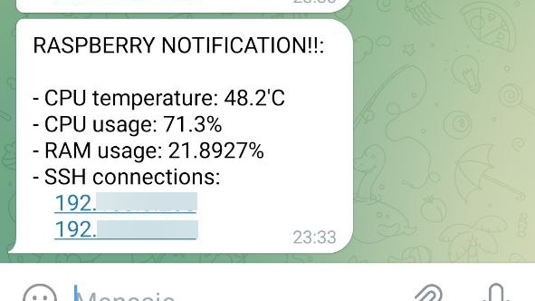
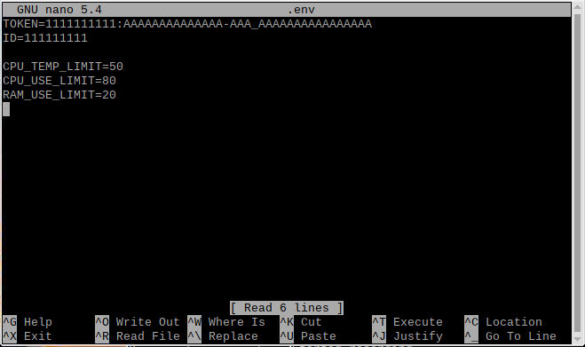
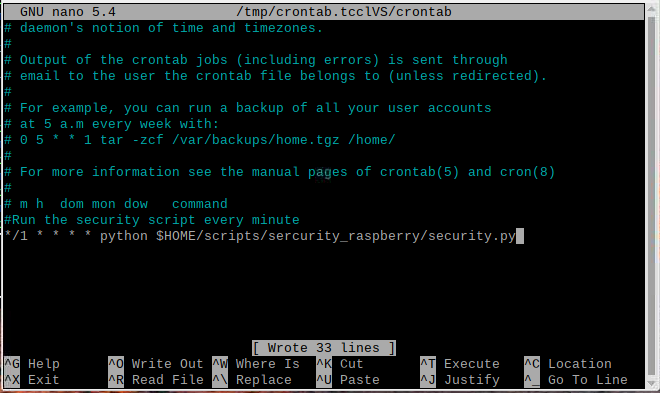

# Sec raspi 1

## Script description

With this simple script you will be able to protect the security of your Raspberry Pi. The script, which consists of a few lines of code, is capable of send alerts to your telegram:

- **CPU exceeds a certain temperature**
- **CPU exceeds a certain usage**
- **RAM exceeds a certain usage**
- **Open SSH terminals**

Example of how the alert would look like in your Telegram bot



## Requirements

You must have previously created your Telegram bot. If you still don't know how to create it, follow the next manual:

[https://www.sudosu.info/how-to-create-a-bot-in-telegram/](https://www.sudosu.info/how-to-create-a-bot-in-telegram/)

You will also need to install the [Dotenv](https://pypi.org/project/python-dotenv/) python library, in order to be able to use the variables in the .env file.

```bash
pip install python-dotenv
```

## Installation

To install it all you need to do is download the program to your scripts folder.

```bash
mkdir $HOME/scripts
cd $HOME/scripts
git clone https://github.com/CarlosPCL98/Sec-raspi-1.git
cd sercurity_raspberry
```

## Set Up variables

All the parameters necessary to run the script must be filled in the .env file.

```bash
nano .env
```



**Note that the script will not work if you use decimals. I recommend that you only fill in the TOKEN and ID variables of your Telegram bot.**

- *CPU_TEMP_LIMIT will be the limit temperature to send an alarm in centrifugal graces.                 Sample: 50 = 50°.*
- *CPU_USE_LIMIT will be the limit percent of CPU use to send an alarm. Sample: 80 = 80%.*
- RAM*_USE_LIMIT will be the limit percent of RAM use to send an alarm. Sample: 20 = 20%.*

## Schedule task

Thanks to a Cronjob in Raspbian, we can schedule this script to be executed every 30seconds/1minute.

Run the following command to edit the Cron editor:

```bash
crontab -e
```

Add the following line at the end:

```bash
*/1 * * * * python $HOME/scripts/Sec-raspi-1/security.py
```



## Understanding the Script

Basically **using the limiters specified in the .env** file, the script run  the **commands to detect temperature, usage or open SSH** **connections**, and they are **compared with the limiters.** If the **condition is exists,** **the message is saved to be sent later.**

Demonstration sample *(If you don't have Troubleshooting issues, you don't need edit this code)*

```python
#CPU TEMPERATURE
cmd_CPU_TEMP='vcgencmd measure_temp|cut -c 6-7'
CPU_TEMP = sp.getoutput(cmd_CPU_TEMP)

# Step 1 - Cheking CPU Temperature
if int(CPU_TEMP) > int(CPU_TEMP_LIMIT):
    MESSAGE+="RASPBERRY NOTIFICATION!!: \n\n"
    count = 1 
    MESSAGE+="- CPU temperature: "+CPU_TEMP_COMPLETA+" \n"

#Sending alarm
if count == 1:
    #Getting main variables from .env
    TOKEN = os.environ.get("TOKEN")
    ID = os.environ.get("ID")
    
    url_req = "https://api.telegram.org/bot" + TOKEN + "/sendMessage" + "?chat_id=" + ID + "&text=" + MESSAGE 
    requests.get(url_req)
```

If you did the configuration correctly you should receive an alarm if the script detects that it should send an alarm.
